## add v chat sdk to the project

## Check Our Full documention
<a href="https://hatemragab.github.io/VChatSdk-Documentation/"> VCHAT Documention</a>   
<a href="https://pub.dev/packages/v_chat_sdk"> v_chat_sdk on pub.dev</a>   

## Screenshots

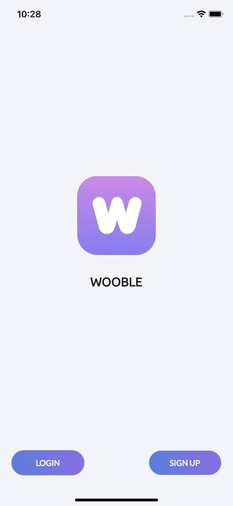 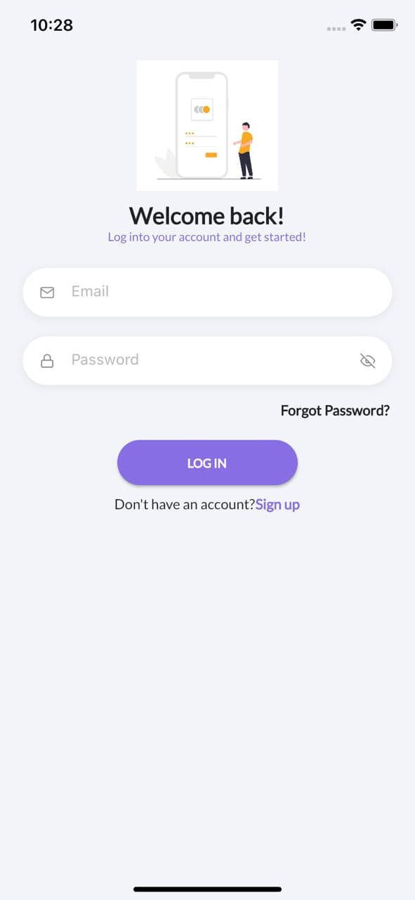
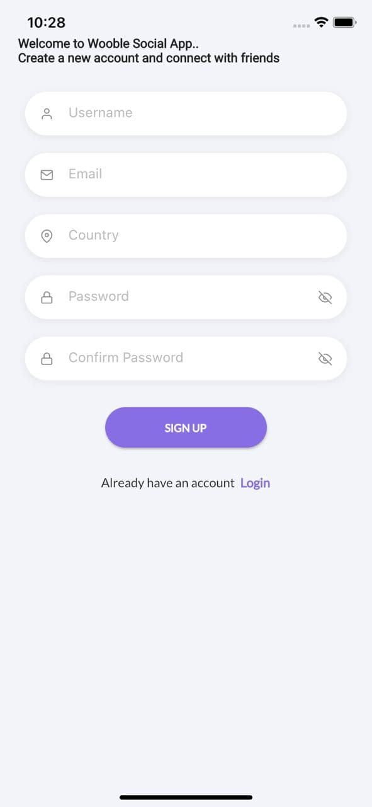 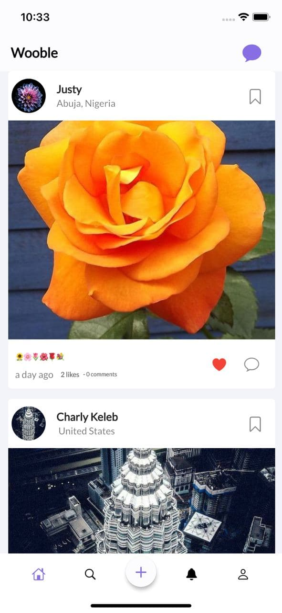
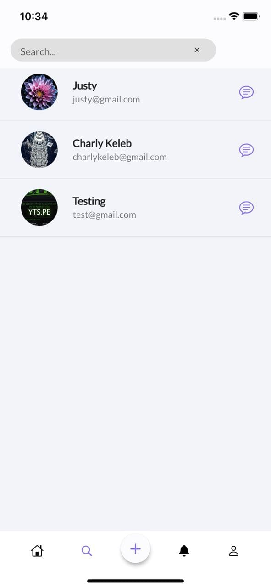 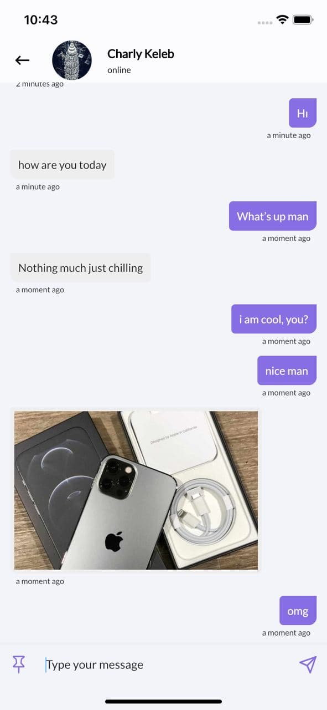
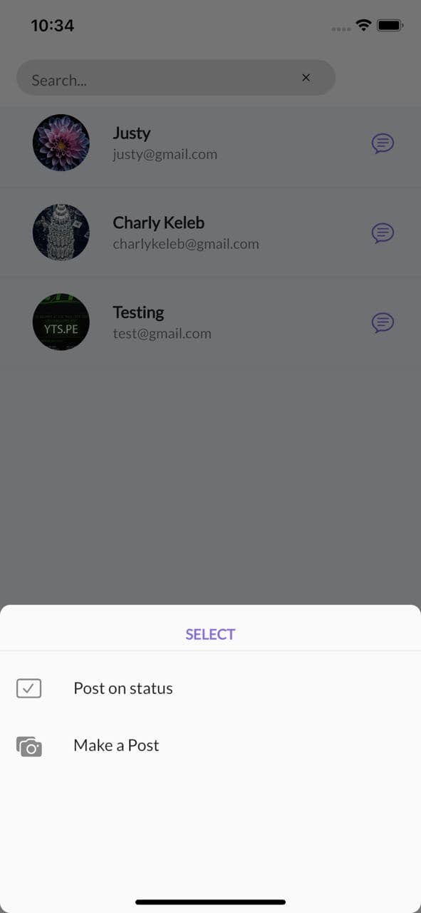 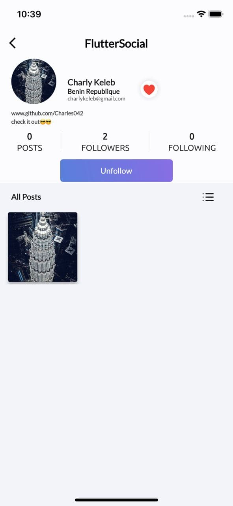
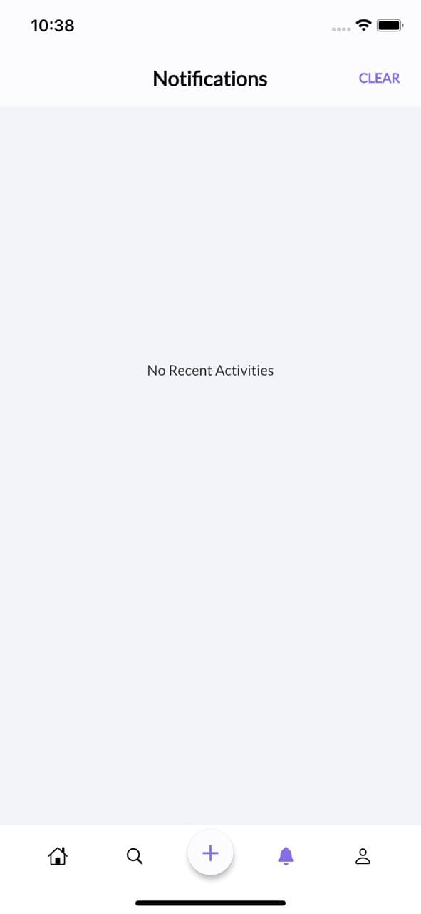 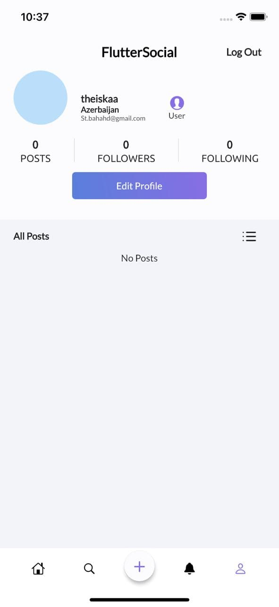
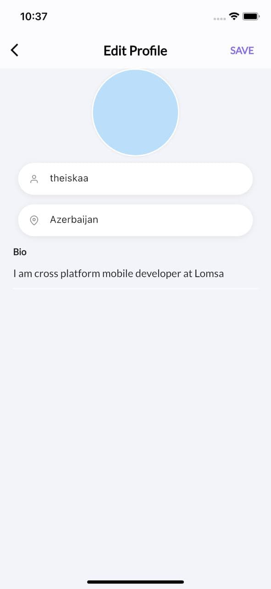 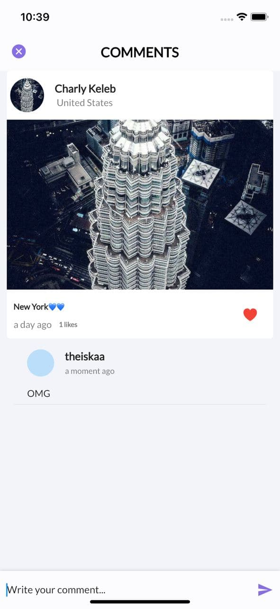

